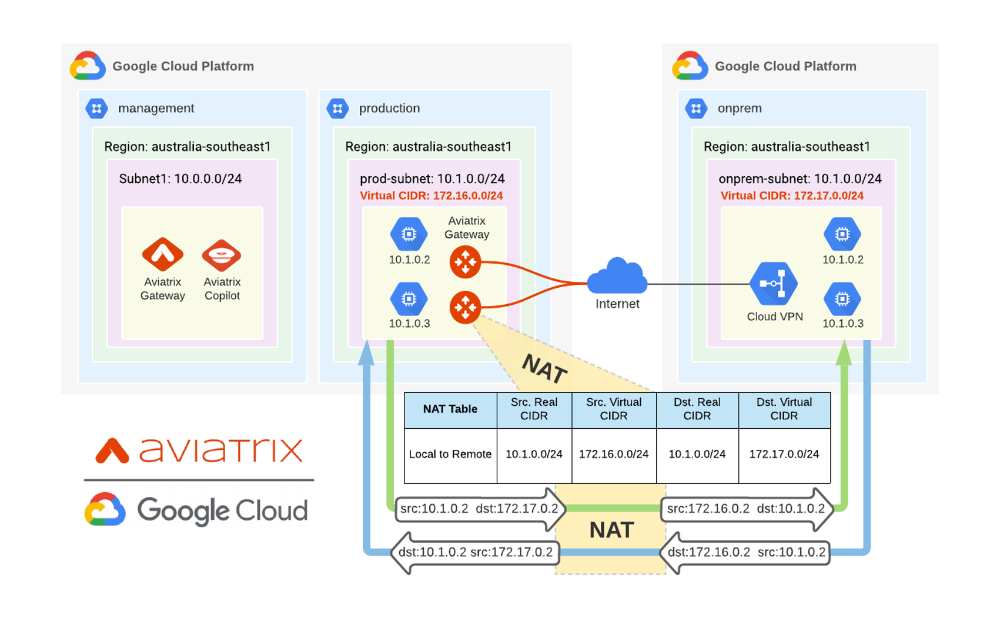

# Overlapping IP with Aviatrix

### Summary

Terraform repository to simulate overlapping IP address in GCP.



File | Description
--- | ---
1_vpc.tf | Create GCP VPCs
2_vm.tf | Create VM Instances in each VPC across two zones
3_spoke_gateway.tf | Create Aviatrix Spoke Gateway in Production VPC
4_classic_vpn.tf | Create GCP Classic VPN using Terraform Module
5_s2c.tf | Create Aviatrix Site2Cloud (IPSec VPN) to GCP Classic VPN

### Prerequisites
Component | Description
--- | --- |
Aviatrix Controller | Aviatrix Controller is Deployed and Running
Google Cloud Platform Credentials | GCP credentials JSON file

### Steps
- Modify ```terraform.tfvars``` as required
- ```export GOOGLE_APPLICATION_CREDENTIALS=<path/credential>.json```
- ```export AVIATRIX_CONTROLLER_IP="<Aviatrix Controller FQDN/IP Address"```
- ```export AVIATRIX_USERNAME="<Aviatrix Controller Username>"```
- ```export AVIATRIX_PASSWORD="<Aviatrix Controller Password>"```